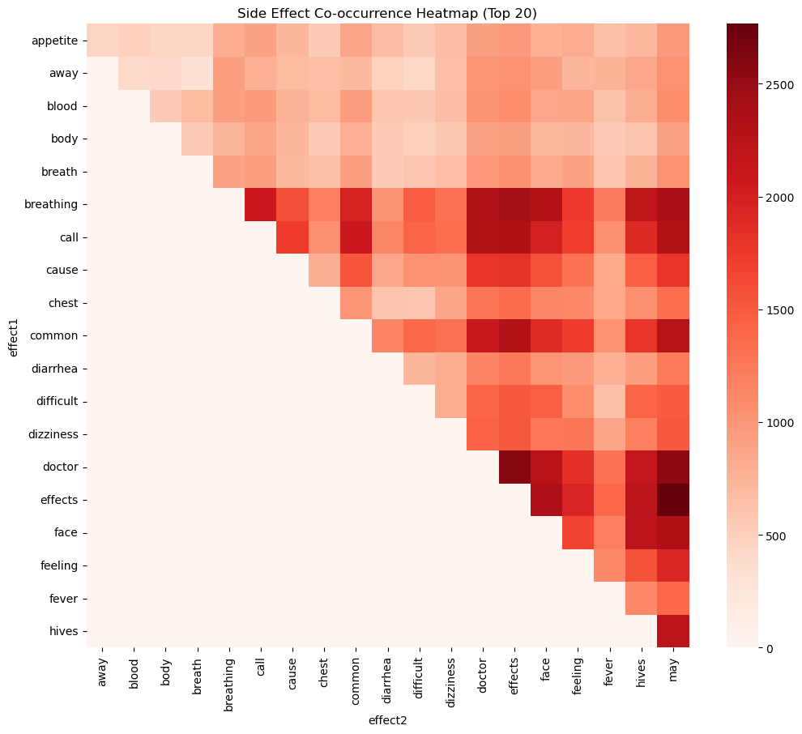
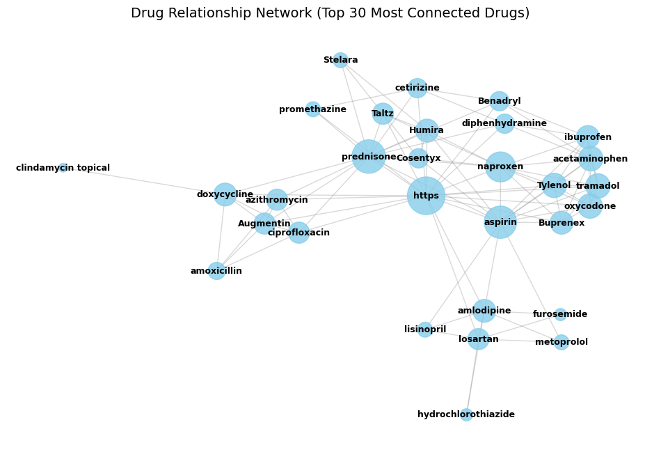
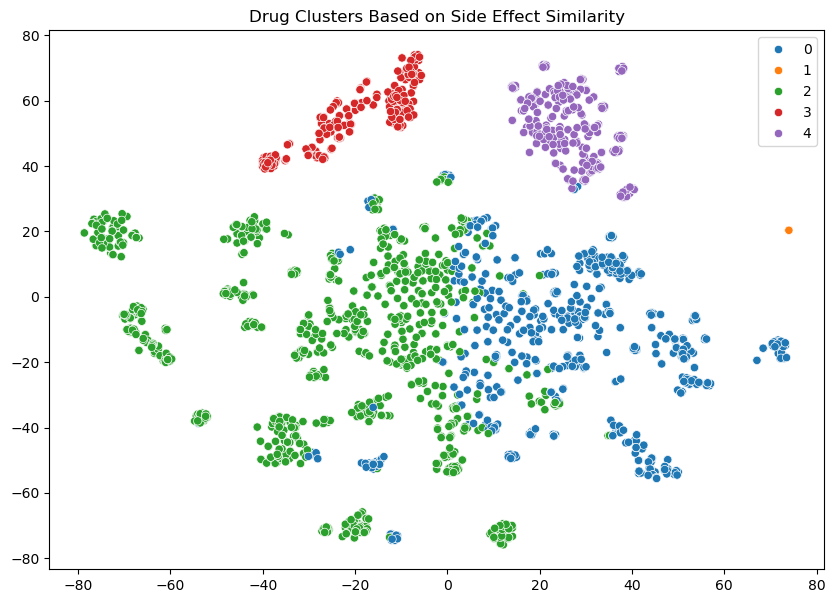

# Drug & Its Side Effects — Data Analysis Project

## Overview
This project explores the **relationship between drugs, their side effects, and related medical conditions** using data analytics, NLP, and visualization techniques.  
It combines **Exploratory Data Analysis (EDA)**, **Network Analysis**, and **Machine Learning Clustering** to uncover patterns in how drugs relate through shared effects.

---

## Tools & Libraries Used

- **Python**
- **pandas, numpy** – Data handling  
- **matplotlib, seaborn, plotly** – Visualization  
- **scikit-learn** – TF-IDF, clustering, dimensionality reduction  
- **NetworkX** – Drug relationship graph  
- **NLTK / re** – Text tokenization and preprocessing  

---

## Step 1: Data Loading and Cleaning

- Loaded the dataset `drugs_side_effects_drugs_com.csv`
- Removed duplicates and missing values
- Tokenized text data (drug names, side effects, related drugs)
- Cleaned text by converting to lowercase and removing special characters

### Insight
A clean dataset ensures accurate downstream analysis. Most drugs had multiple side effects, and a few appeared across several medical conditions — indicating **drug repurposing potential**.

---

## Step 2: Exploratory Data Analysis (EDA)

- Counted the most frequent drugs and side effects  
- Visualized side-effect distributions using **bar plots** and **word clouds**  
- Explored how many drugs are linked to each medical condition

### Insight
- Common side effects: *nausea, headache, dizziness, drowsiness*  
- Highly reported conditions: *Depression, Pain, Anxiety*  
- A few drugs dominate multiple therapeutic areas — showing versatility but also risk of overlapping side effects.

---

## Step 3: Co-occurrence Heatmap of Side Effects

- Created a **co-occurrence matrix** of side effects using pairwise frequency counts  
- Visualized relationships using a **heatmap**
- View my notebook with detailed steps here:
[Sideeffect Co-0ccurrence Heatmap](ExploratoryDataAnalysis.ipynb)

### Visualization


### Insight
- The heatmap reveals **clusters of side effects** that frequently appear together.  
  Example: *nausea, vomiting, and diarrhea* often co-occur in antibiotics.  
- Patterns suggest shared biological mechanisms or overlapping target pathways.

---

## Step 4: Drug Relationship Network Graph

### What We Did
We constructed a **NetworkX graph** where:
- **Nodes** represent drugs  
- **Edges** connect drugs sharing “related drug” mentions  

```python
G = nx.Graph()
for idx, row in df.iterrows():
    drug = row['drug_name']
    related = row['tokenized_related_drugs']
    for r in related:
        G.add_edge(drug, r)
 ```
## Visualization

- The initial graph appeared too dense, so we refined it by filtering to the **top-degree drugs** or using **spring layout** for clarity.  
- This made the structure interpretable, showing major hubs of interconnected drugs.
- View my notebook with detailed steps here
[Advance Data Analysis](AdvanceDataAnalysis.ipynb)


### Insight
- Central nodes represent **commonly referenced drugs** — possibly those with wide therapeutic use or many substitutes.  
- The structure reveals **clusters of therapeutically similar drugs**, helping identify substitute or combination options.

---

## Step 5: Condition-Specific Side Effects

Grouped side effects by medical condition to identify **unique and common patterns**:

```python
condition_group = data.groupby('medical_condition')['tokenized_side_effects']\
    .apply(lambda x: set([item for sublist in x for item in sublist]))
```

Insight
- Depression & Anxiety share overlapping side effects: fatigue, dizziness, insomnia.
- Pain-related conditions had higher occurrence of nausea, constipation, and drowsiness.
- Rare conditions (e.g., autoimmune disorders) had unique side effects, indicating targeted treatments.

### Visualization


---
### Step 6: Drug Clustering Based on Side-Effect Similarity
---

- Used TF-IDF Vectorization and K-Means clustering to group drugs with similar side-effect profiles.
- Visualized results using t-SNE dimensionality reduction.

### Visualization
Screenshot:
images/drug_clusters_tsne.png

### Insights
- Each point = one drug; color = one cluster.

| Cluster | Description | Example Pattern |
|----------|--------------|----------------|
| 🟦 0 | General-use drugs with mild overlapping side effects | Headache, dizziness |
| 🟧 1 | Outlier drugs with rare or unique effects | Specialized medications |
| 🟩 2 | Systemic side effects (pain relievers, antibiotics) | Fatigue, nausea |
| 🟥 3 | Strong multi-system side effects | Chemotherapy drugs |
| 🟪 4 | Neurological/psychiatric drugs | Drowsiness, mood changes |
---
### Step 7: Key Takeaways & Insights
---
## Data Relationships
- Drugs often share multiple side effects, suggesting overlapping biological mechanisms.
-  side effects co-occur frequently, forming natural clusters of symptoms.

## Visualization Learnings
- The heatmap shows co-occurring side effects.
- The network graph reveals therapeutic connectivity.
- The t-SNE cluster plot shows how drugs group by biological similarity.

## Real-World Application
- Supports drug repurposing by identifying similar effect profiles.
- Helps doctors predict secondary effects of related drugs.
- Useful for pharmaceutical R&D in drug classification and patient safety analysis.
---

### Conclusion
---

- This project combines data cleaning, text mining, network analysis, and clustering to explore complex relationships among drugs and their side effects.
- It demonstrates how data science can uncover medically relevant patterns and supports the development of safer, more informed treatments.
----
